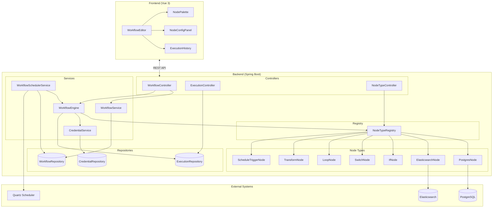

# Dynamic Workflow System Development Plan

**Tech Stack:** Spring Boot (Java 17) + Vue 3 + Ant Design Vue + Vue Flow
**Reference:** n8n workflow architecture
**Focus:** Synchronize and transform data between Elasticsearch and PostgreSQL

---

## Table of Contents

1. [Core Data Structures](#1-core-data-structures)
   - 1.5 Backend Class Diagram
   - 1.6 Component Architecture Diagram
2. [Node Type System](#2-node-type-system)
3. [Node Implementations](#3-node-implementations)
   - 3.1-3.6 Database, Transform, Logic Nodes
   - 3.7 Loop Node
4. [Execution Engine](#4-execution-engine)
5. [Scheduler Service](#5-scheduler-service)
6. [REST API](#6-rest-api)
7. [Frontend Architecture](#7-frontend-architecture)
8. [Handling Large Datasets](#8-handling-large-datasets)
9. [n8n Reference Files](#9-n8n-reference-files)
10. [Design Principles](#10-design-principles) (SCSS)
11. [Ant Design Vue Integration](#11-ant-design-vue-integration)
12. [Coding Rules](#12-coding-rules)
13. [Code Examples](#13-code-examples)

---

## 1. Core Data Structures

### 1.1 Workflow Entity

```java
@Entity
@Table(name = "workflows")
public class Workflow {
    @Id
    @GeneratedValue(strategy = GenerationType.UUID)
    private String id;

    private String name;
    private boolean active;

    @Type(JsonType.class)
    @Column(columnDefinition = "json")
    private List<WorkflowNode> nodes;

    @Type(JsonType.class)
    @Column(columnDefinition = "json")
    private Map<String, NodeConnections> connections;

    @Type(JsonType.class)
    @Column(columnDefinition = "json")
    private WorkflowSettings settings;

    private LocalDateTime createdAt;
    private LocalDateTime updatedAt;
}
```

### 1.2 Node Structure

```java
public class WorkflowNode {
    private String id;
    private String name;
    private String type;           // e.g., "postgres", "elasticsearch", "if", "switch"
    private int typeVersion;
    private int[] position;        // [x, y] coordinates
    private boolean disabled;
    private Map<String, Object> parameters;
    private Map<String, String> credentials;  // Reference to credential IDs
}
```

### 1.3 Connection Structure

```java
// Following n8n pattern: connections[sourceNodeName][connectionType][outputIndex][]
public class NodeConnections {
    // Key: connection type (usually "main")
    private Map<String, List<List<Connection>>> outputs;
}

public class Connection {
    private String node;    // Target node name
    private String type;    // Connection type ("main")
    private int index;      // Target input index
}
```

### 1.4 Execution Data

```java
public class NodeExecutionData {
    private Map<String, Object> json;      // Main data payload
    private Map<String, Object> binary;    // Binary data (optional)
    private PairedItemData pairedItem;     // Item tracking
}

public class TaskData {
    private long startTime;
    private long executionTime;
    private String executionStatus;  // "success", "error", "canceled"
    private Map<String, List<List<NodeExecutionData>>> data;
    private ExecutionError error;
    private List<TaskDataSource> source;
}
```

### 1.5 Backend Class Diagram

```mermaid
classDiagram
    direction TB

    %% Core Domain Models
    class Workflow {
        -String id
        -String name
        -boolean active
        -List~WorkflowNode~ nodes
        -Map~String, NodeConnections~ connections
        -WorkflowSettings settings
        -LocalDateTime createdAt
        -LocalDateTime updatedAt
        +findNode(id) WorkflowNode
        +findNodeByName(name) WorkflowNode
        +getStartNode() WorkflowNode
    }

    class WorkflowNode {
        -String id
        -String name
        -String type
        -int typeVersion
        -int[] position
        -boolean disabled
        -Map~String, Object~ parameters
        -Map~String, String~ credentials
    }

    class NodeConnections {
        -Map~String, List~List~Connection~~~ outputs
    }

    class Connection {
        -String node
        -String type
        -int index
    }

    %% Execution Models
    class NodeExecutionData {
        -Map~String, Object~ json
        -Map~String, Object~ binary
        -PairedItemData pairedItem
    }

    class TaskData {
        -long startTime
        -long executionTime
        -String executionStatus
        -Map~String, List~List~NodeExecutionData~~~ data
        -ExecutionError error
    }

    class ExecutionResult {
        -String executionId
        -ExecutionStatus status
        -Map~String, TaskData~ runData
        -LocalDateTime startedAt
        -LocalDateTime finishedAt
    }

    %% Node Type System
    class NodeType {
        <<interface>>
        +getDescription() NodeTypeDescription
        +execute(context) List~List~NodeExecutionData~~
    }

    class TriggerNodeType {
        <<interface>>
        +trigger(context) TriggerResult
    }

    class NodeTypeDescription {
        -String name
        -String displayName
        -String description
        -String icon
        -String color
        -String[] group
        -int version
        -List~NodeIOConfiguration~ inputs
        -List~NodeIOConfiguration~ outputs
        -List~NodeProperty~ properties
    }

    class NodeTypeRegistry {
        -Map~String, NodeType~ registry
        +getNodeType(name) NodeType
        +getAllDescriptions() List~NodeTypeDescription~
        +register(nodeType) void
    }

    %% Node Implementations
    class PostgresNode {
        +getDescription() NodeTypeDescription
        +execute(context) List~List~NodeExecutionData~~
        -executeSelect(context)
        -executeInsert(context)
        -executeUpdate(context)
        -executeDelete(context)
    }

    class ElasticsearchNode {
        +getDescription() NodeTypeDescription
        +execute(context) List~List~NodeExecutionData~~
        -executeSearch(context)
        -executeIndex(context)
        -executeBulk(context)
    }

    class IfNode {
        +getDescription() NodeTypeDescription
        +execute(context) List~List~NodeExecutionData~~
        -evaluateCondition(item, condition) boolean
    }

    class SwitchNode {
        +getDescription() NodeTypeDescription
        +execute(context) List~List~NodeExecutionData~~
        -matchRule(value, rule) boolean
    }

    class LoopNode {
        +getDescription() NodeTypeDescription
        +execute(context) List~List~NodeExecutionData~~
        -executeLoopOverItems(context)
        -executeLoopCount(context)
        -executeLoopWhile(context)
    }

    class TransformNode {
        +getDescription() NodeTypeDescription
        +execute(context) List~List~NodeExecutionData~~
        -executeMapFields(context)
    }

    class ScheduleTriggerNode {
        +getDescription() NodeTypeDescription
        +trigger(context) TriggerResult
    }

    %% Services
    class WorkflowEngine {
        -NodeTypeRegistry nodeRegistry
        -CredentialService credentialService
        -ExecutionRepository executionRepository
        +execute(workflow) ExecutionResult
        +execute(workflow, startNodeId) ExecutionResult
        -processNode(node, inputData) List~List~NodeExecutionData~~
        -queueConnectedNodes(workflow, node, outputData)
    }

    class WorkflowSchedulerService {
        -Scheduler scheduler
        -WorkflowRepository workflowRepository
        -WorkflowEngine workflowEngine
        +scheduleWorkflow(workflow) void
        +unscheduleWorkflow(workflowId) void
        +activateWorkflow(workflowId) void
        +deactivateWorkflow(workflowId) void
    }

    class NodeExecutionContext {
        -WorkflowNode node
        -List~NodeExecutionData~ inputData
        -Map~String, Object~ parameters
        -Map~String, Object~ credentials
        -Workflow workflow
        -String executionId
        +getParameter(name, type) T
        +getInputData() List~NodeExecutionData~
        +getCredential(name, type) T
    }

    %% Repositories
    class WorkflowRepository {
        <<interface>>
        +findById(id) Optional~Workflow~
        +findByActiveTrue() List~Workflow~
        +save(workflow) Workflow
        +delete(workflow) void
    }

    class ExecutionRepository {
        <<interface>>
        +findById(id) Optional~ExecutionResult~
        +findByWorkflowId(workflowId) List~ExecutionResult~
        +save(execution) ExecutionResult
    }

    %% Controllers
    class WorkflowController {
        -WorkflowService workflowService
        -WorkflowEngine workflowEngine
        +listWorkflows() List~Workflow~
        +createWorkflow(request) Workflow
        +getWorkflow(id) Workflow
        +updateWorkflow(id, request) Workflow
        +deleteWorkflow(id) void
        +executeWorkflow(id) ExecutionResult
    }

    %% Relationships
    Workflow "1" *-- "*" WorkflowNode : contains
    Workflow "1" *-- "*" NodeConnections : has
    NodeConnections "1" *-- "*" Connection : contains

    NodeType <|.. PostgresNode : implements
    NodeType <|.. ElasticsearchNode : implements
    NodeType <|.. IfNode : implements
    NodeType <|.. SwitchNode : implements
    NodeType <|.. LoopNode : implements
    NodeType <|.. TransformNode : implements
    TriggerNodeType <|.. ScheduleTriggerNode : implements
    NodeType <|-- TriggerNodeType : extends

    NodeTypeRegistry "1" o-- "*" NodeType : manages

    WorkflowEngine --> NodeTypeRegistry : uses
    WorkflowEngine --> WorkflowRepository : uses
    WorkflowEngine --> ExecutionRepository : uses
    WorkflowEngine ..> NodeExecutionContext : creates
    WorkflowEngine ..> ExecutionResult : produces

    WorkflowSchedulerService --> WorkflowEngine : uses
    WorkflowSchedulerService --> WorkflowRepository : uses

    WorkflowController --> WorkflowEngine : uses

    NodeType ..> NodeTypeDescription : returns
    NodeType ..> NodeExecutionData : produces
```



### 1.6 Component Architecture Diagram



---

## 2. Node Type System

### 2.1 Node Type Interface

```java
public interface NodeType {
    NodeTypeDescription getDescription();

    List<List<NodeExecutionData>> execute(NodeExecutionContext context)
        throws NodeExecutionException;
}
```

### 2.2 Node Type Description

```java
public class NodeTypeDescription {
    private String name;              // Unique identifier: "postgres", "if", etc.
    private String displayName;       // UI display name
    private String description;
    private String icon;
    private String[] group;           // ["transform", "database", "trigger"]
    private int version;

    // Input/Output configuration
    private List<NodeIOConfiguration> inputs;
    private List<NodeIOConfiguration> outputs;
    private String[] outputNames;     // For conditional nodes: ["true", "false"]

    // Parameter definitions for UI
    private List<NodeProperty> properties;

    // Credential requirements
    private List<CredentialDescription> credentials;
}

public class NodeProperty {
    private String name;
    private String displayName;
    private String type;              // "string", "number", "options", "collection"
    private Object defaultValue;
    private boolean required;
    private List<PropertyOption> options;  // For dropdown selections
    private String placeholder;
    private String description;
}
```

### 2.3 Node Registry

```java
@Component
public class NodeTypeRegistry {
    private final Map<String, NodeType> registry = new HashMap<>();

    @Autowired
    public NodeTypeRegistry(List<NodeType> nodeTypes) {
        nodeTypes.forEach(node ->
            registry.put(node.getDescription().getName(), node)
        );
    }

    public NodeType getNodeType(String typeName) {
        return registry.get(typeName);
    }

    public List<NodeTypeDescription> getAllDescriptions() {
        return registry.values().stream()
            .map(NodeType::getDescription)
            .collect(Collectors.toList());
    }
}
```

---

## 3. Node Implementations

### 3.1 PostgreSQL Node

```java
@Component
public class PostgresNode implements NodeType {

    @Override
    public NodeTypeDescription getDescription() {
        return NodeTypeDescription.builder()
            .name("postgres")
            .displayName("PostgreSQL")
            .description("Execute queries on PostgreSQL database")
            .icon("postgres.svg")
            .group(new String[]{"database"})
            .version(1)
            .inputs(List.of(new NodeIOConfiguration("main")))
            .outputs(List.of(new NodeIOConfiguration("main")))
            .properties(List.of(
                NodeProperty.builder()
                    .name("operation")
                    .displayName("Operation")
                    .type("options")
                    .options(List.of(
                        new PropertyOption("select", "Select"),
                        new PropertyOption("insert", "Insert"),
                        new PropertyOption("update", "Update"),
                        new PropertyOption("delete", "Delete"),
                        new PropertyOption("createTable", "Create Table")
                    ))
                    .defaultValue("select")
                    .build(),
                NodeProperty.builder()
                    .name("table")
                    .displayName("Table")
                    .type("string")
                    .required(true)
                    .build(),
                NodeProperty.builder()
                    .name("query")
                    .displayName("Query")
                    .type("string")
                    .typeOptions(Map.of("rows", 5))
                    .description("Raw SQL query (for advanced usage)")
                    .build(),
                NodeProperty.builder()
                    .name("columns")
                    .displayName("Columns")
                    .type("string")
                    .defaultValue("*")
                    .build(),
                NodeProperty.builder()
                    .name("whereConditions")
                    .displayName("Where Conditions")
                    .type("collection")
                    .build()
            ))
            .credentials(List.of(
                new CredentialDescription("postgres", "PostgreSQL Connection", true)
            ))
            .build();
    }

    @Override
    public List<List<NodeExecutionData>> execute(NodeExecutionContext context) {
        String operation = context.getParameter("operation", String.class);
        String table = context.getParameter("table", String.class);

        DataSource dataSource = context.getCredential("postgres", DataSource.class);
        JdbcTemplate jdbc = new JdbcTemplate(dataSource);

        List<NodeExecutionData> results = new ArrayList<>();

        switch (operation) {
            case "select":
                results = executeSelect(jdbc, context);
                break;
            case "insert":
                results = executeInsert(jdbc, context);
                break;
            case "update":
                results = executeUpdate(jdbc, context);
                break;
            case "delete":
                results = executeDelete(jdbc, context);
                break;
            case "createTable":
                results = executeCreateTable(jdbc, context);
                break;
        }

        return List.of(results);  // Single output
    }

    private List<NodeExecutionData> executeSelect(JdbcTemplate jdbc, NodeExecutionContext ctx) {
        String table = ctx.getParameter("table", String.class);
        String columns = ctx.getParameter("columns", String.class, "*");
        String where = buildWhereClause(ctx.getParameter("whereConditions", List.class));

        String sql = String.format("SELECT %s FROM %s %s", columns, table, where);

        List<Map<String, Object>> rows = jdbc.queryForList(sql);

        return rows.stream()
            .map(row -> new NodeExecutionData(row))
            .collect(Collectors.toList());
    }
}
```

### 3.2 Elasticsearch Node

```java
@Component
public class ElasticsearchNode implements NodeType {

    @Override
    public NodeTypeDescription getDescription() {
        return NodeTypeDescription.builder()
            .name("elasticsearch")
            .displayName("Elasticsearch")
            .description("Query and manipulate Elasticsearch data")
            .icon("elasticsearch.svg")
            .group(new String[]{"database"})
            .version(1)
            .inputs(List.of(new NodeIOConfiguration("main")))
            .outputs(List.of(new NodeIOConfiguration("main")))
            .properties(List.of(
                NodeProperty.builder()
                    .name("operation")
                    .displayName("Operation")
                    .type("options")
                    .options(List.of(
                        new PropertyOption("search", "Search"),
                        new PropertyOption("index", "Index Document"),
                        new PropertyOption("update", "Update Document"),
                        new PropertyOption("delete", "Delete Document"),
                        new PropertyOption("bulk", "Bulk Operation")
                    ))
                    .defaultValue("search")
                    .build(),
                NodeProperty.builder()
                    .name("index")
                    .displayName("Index")
                    .type("string")
                    .required(true)
                    .build(),
                NodeProperty.builder()
                    .name("query")
                    .displayName("Query (JSON)")
                    .type("json")
                    .description("Elasticsearch query DSL")
                    .build(),
                NodeProperty.builder()
                    .name("documentId")
                    .displayName("Document ID")
                    .type("string")
                    .build()
            ))
            .credentials(List.of(
                new CredentialDescription("elasticsearch", "Elasticsearch Connection", true)
            ))
            .build();
    }

    @Override
    public List<List<NodeExecutionData>> execute(NodeExecutionContext context) {
        String operation = context.getParameter("operation", String.class);
        RestHighLevelClient client = context.getCredential("elasticsearch", RestHighLevelClient.class);

        List<NodeExecutionData> results = switch (operation) {
            case "search" -> executeSearch(client, context);
            case "index" -> executeIndex(client, context);
            case "update" -> executeUpdate(client, context);
            case "delete" -> executeDelete(client, context);
            case "bulk" -> executeBulk(client, context);
            default -> throw new NodeExecutionException("Unknown operation: " + operation);
        };

        return List.of(results);
    }

    private List<NodeExecutionData> executeSearch(RestHighLevelClient client, NodeExecutionContext ctx) {
        String index = ctx.getParameter("index", String.class);
        Map<String, Object> queryDsl = ctx.getParameter("query", Map.class);

        SearchRequest request = new SearchRequest(index);
        SearchSourceBuilder sourceBuilder = new SearchSourceBuilder();
        sourceBuilder.query(QueryBuilders.wrapperQuery(new ObjectMapper().writeValueAsString(queryDsl)));
        request.source(sourceBuilder);

        SearchResponse response = client.search(request, RequestOptions.DEFAULT);

        return Arrays.stream(response.getHits().getHits())
            .map(hit -> {
                Map<String, Object> doc = hit.getSourceAsMap();
                doc.put("_id", hit.getId());
                doc.put("_index", hit.getIndex());
                return new NodeExecutionData(doc);
            })
            .collect(Collectors.toList());
    }
}
```

### 3.3 If Node (Conditional)

```java
@Component
public class IfNode implements NodeType {

    @Override
    public NodeTypeDescription getDescription() {
        return NodeTypeDescription.builder()
            .name("if")
            .displayName("If")
            .description("Route items based on conditions")
            .icon("if.svg")
            .group(new String[]{"flow"})
            .version(2)
            .inputs(List.of(new NodeIOConfiguration("main")))
            .outputs(List.of(
                new NodeIOConfiguration("main"),  // true branch
                new NodeIOConfiguration("main")   // false branch
            ))
            .outputNames(new String[]{"true", "false"})
            .properties(List.of(
                NodeProperty.builder()
                    .name("conditions")
                    .displayName("Conditions")
                    .type("conditions")
                    .build(),
                NodeProperty.builder()
                    .name("combineOperation")
                    .displayName("Combine")
                    .type("options")
                    .options(List.of(
                        new PropertyOption("all", "AND"),
                        new PropertyOption("any", "OR")
                    ))
                    .defaultValue("all")
                    .build()
            ))
            .build();
    }

    @Override
    public List<List<NodeExecutionData>> execute(NodeExecutionContext context) {
        List<NodeExecutionData> trueItems = new ArrayList<>();
        List<NodeExecutionData> falseItems = new ArrayList<>();

        List<NodeExecutionData> inputItems = context.getInputData();

        for (int i = 0; i < inputItems.size(); i++) {
            NodeExecutionData item = inputItems.get(i);
            boolean pass = evaluateConditions(item, context, i);

            if (pass) {
                trueItems.add(item);
            } else {
                falseItems.add(item);
            }
        }

        // Return 2D array: [trueItems, falseItems]
        return List.of(trueItems, falseItems);
    }

    private boolean evaluateConditions(NodeExecutionData item, NodeExecutionContext ctx, int itemIndex) {
        List<Condition> conditions = ctx.getParameter("conditions", itemIndex, List.class);
        String combineOp = ctx.getParameter("combineOperation", String.class, "all");

        if ("all".equals(combineOp)) {
            return conditions.stream().allMatch(c -> evaluateCondition(c, item));
        } else {
            return conditions.stream().anyMatch(c -> evaluateCondition(c, item));
        }
    }

    private boolean evaluateCondition(Condition condition, NodeExecutionData item) {
        Object leftValue = resolveValue(condition.getLeftValue(), item);
        Object rightValue = resolveValue(condition.getRightValue(), item);

        return switch (condition.getOperator()) {
            case "equals" -> Objects.equals(leftValue, rightValue);
            case "notEquals" -> !Objects.equals(leftValue, rightValue);
            case "contains" -> String.valueOf(leftValue).contains(String.valueOf(rightValue));
            case "greaterThan" -> compareNumbers(leftValue, rightValue) > 0;
            case "lessThan" -> compareNumbers(leftValue, rightValue) < 0;
            case "isEmpty" -> leftValue == null || leftValue.toString().isEmpty();
            case "isNotEmpty" -> leftValue != null && !leftValue.toString().isEmpty();
            default -> false;
        };
    }
}
```

### 3.4 Switch Node

```java
@Component
public class SwitchNode implements NodeType {

    @Override
    public NodeTypeDescription getDescription() {
        return NodeTypeDescription.builder()
            .name("switch")
            .displayName("Switch")
            .description("Route items to different outputs based on value")
            .icon("switch.svg")
            .group(new String[]{"flow"})
            .version(1)
            .inputs(List.of(new NodeIOConfiguration("main")))
            .outputs(List.of())  // Dynamic outputs based on rules
            .properties(List.of(
                NodeProperty.builder()
                    .name("dataPropertyName")
                    .displayName("Value to Match")
                    .type("string")
                    .required(true)
                    .build(),
                NodeProperty.builder()
                    .name("rules")
                    .displayName("Routing Rules")
                    .type("fixedCollection")
                    .typeOptions(Map.of("multipleValues", true))
                    .build(),
                NodeProperty.builder()
                    .name("fallbackOutput")
                    .displayName("Fallback Output")
                    .type("options")
                    .options(List.of(
                        new PropertyOption("none", "None"),
                        new PropertyOption("extra", "Extra Output")
                    ))
                    .defaultValue("none")
                    .build()
            ))
            .build();
    }

    @Override
    public List<List<NodeExecutionData>> execute(NodeExecutionContext context) {
        List<SwitchRule> rules = context.getParameter("rules", List.class);
        String fallback = context.getParameter("fallbackOutput", String.class, "none");
        String propertyName = context.getParameter("dataPropertyName", String.class);

        int outputCount = rules.size() + ("extra".equals(fallback) ? 1 : 0);
        List<List<NodeExecutionData>> outputs = new ArrayList<>();
        for (int i = 0; i < outputCount; i++) {
            outputs.add(new ArrayList<>());
        }

        for (NodeExecutionData item : context.getInputData()) {
            Object value = item.getJson().get(propertyName);
            boolean matched = false;

            for (int i = 0; i < rules.size(); i++) {
                if (matchesRule(value, rules.get(i))) {
                    outputs.get(i).add(item);
                    matched = true;
                    break;
                }
            }

            if (!matched && "extra".equals(fallback)) {
                outputs.get(outputs.size() - 1).add(item);
            }
        }

        return outputs;
    }
}
```

### 3.5 Transform Node

```java
@Component
public class TransformNode implements NodeType {

    @Override
    public NodeTypeDescription getDescription() {
        return NodeTypeDescription.builder()
            .name("transform")
            .displayName("Transform")
            .description("Transform and map data fields")
            .icon("transform.svg")
            .group(new String[]{"transform"})
            .version(1)
            .inputs(List.of(new NodeIOConfiguration("main")))
            .outputs(List.of(new NodeIOConfiguration("main")))
            .properties(List.of(
                NodeProperty.builder()
                    .name("mode")
                    .displayName("Mode")
                    .type("options")
                    .options(List.of(
                        new PropertyOption("mapFields", "Map Fields"),
                        new PropertyOption("jsonata", "JSONata Expression"),
                        new PropertyOption("javascript", "JavaScript")
                    ))
                    .defaultValue("mapFields")
                    .build(),
                NodeProperty.builder()
                    .name("fieldMappings")
                    .displayName("Field Mappings")
                    .type("fixedCollection")
                    .typeOptions(Map.of("multipleValues", true))
                    .build(),
                NodeProperty.builder()
                    .name("expression")
                    .displayName("Expression")
                    .type("string")
                    .typeOptions(Map.of("rows", 10))
                    .build()
            ))
            .build();
    }

    @Override
    public List<List<NodeExecutionData>> execute(NodeExecutionContext context) {
        String mode = context.getParameter("mode", String.class);

        List<NodeExecutionData> results = switch (mode) {
            case "mapFields" -> executeMapFields(context);
            case "jsonata" -> executeJsonata(context);
            default -> throw new NodeExecutionException("Unknown mode: " + mode);
        };

        return List.of(results);
    }

    private List<NodeExecutionData> executeMapFields(NodeExecutionContext context) {
        List<FieldMapping> mappings = context.getParameter("fieldMappings", List.class);

        return context.getInputData().stream()
            .map(item -> {
                Map<String, Object> newJson = new HashMap<>();

                for (FieldMapping mapping : mappings) {
                    Object value = resolveFieldPath(item.getJson(), mapping.getSourceField());
                    if (mapping.getTransform() != null) {
                        value = applyTransform(value, mapping.getTransform());
                    }
                    setFieldPath(newJson, mapping.getTargetField(), value);
                }

                return new NodeExecutionData(newJson);
            })
            .collect(Collectors.toList());
    }
}
```

### 3.6 Schedule Trigger Node

```java
@Component
public class ScheduleTriggerNode implements TriggerNodeType {

    @Override
    public NodeTypeDescription getDescription() {
        return NodeTypeDescription.builder()
            .name("scheduleTrigger")
            .displayName("Schedule Trigger")
            .description("Trigger workflow on a schedule")
            .icon("schedule.svg")
            .group(new String[]{"trigger", "schedule"})
            .version(1)
            .inputs(List.of())  // No inputs for triggers
            .outputs(List.of(new NodeIOConfiguration("main")))
            .properties(List.of(
                NodeProperty.builder()
                    .name("rule")
                    .displayName("Trigger Rule")
                    .type("options")
                    .options(List.of(
                        new PropertyOption("interval", "Interval"),
                        new PropertyOption("cron", "Cron Expression")
                    ))
                    .defaultValue("interval")
                    .build(),
                NodeProperty.builder()
                    .name("intervalValue")
                    .displayName("Interval")
                    .type("number")
                    .defaultValue(1)
                    .build(),
                NodeProperty.builder()
                    .name("intervalUnit")
                    .displayName("Unit")
                    .type("options")
                    .options(List.of(
                        new PropertyOption("seconds", "Seconds"),
                        new PropertyOption("minutes", "Minutes"),
                        new PropertyOption("hours", "Hours"),
                        new PropertyOption("days", "Days")
                    ))
                    .defaultValue("hours")
                    .build(),
                NodeProperty.builder()
                    .name("cronExpression")
                    .displayName("Cron Expression")
                    .type("string")
                    .placeholder("0 0 * * *")
                    .build()
            ))
            .build();
    }

    @Override
    public TriggerResult trigger(TriggerContext context) {
        // Returns trigger configuration for scheduler service
        String rule = context.getParameter("rule", String.class);

        String cronExpression;
        if ("cron".equals(rule)) {
            cronExpression = context.getParameter("cronExpression", String.class);
        } else {
            cronExpression = buildCronFromInterval(context);
        }

        return new TriggerResult(cronExpression, this::generateTriggerData);
    }

    private List<List<NodeExecutionData>> generateTriggerData() {
        Map<String, Object> data = Map.of(
            "timestamp", Instant.now().toString(),
            "triggerTime", LocalDateTime.now().toString()
        );
        return List.of(List.of(new NodeExecutionData(data)));
    }
}
```

### 3.7 Loop Node

```java
@Component
public class LoopNode implements NodeType {

    @Override
    public NodeTypeDescription getDescription() {
        return NodeTypeDescription.builder()
            .name("loop")
            .displayName("Loop")
            .description("Iterate over items or execute a fixed number of times")
            .icon("loop.svg")
            .color("#eb6f00")
            .group(new String[]{"flow"})
            .version(1)
            .inputs(List.of(new NodeIOConfiguration("main")))
            .outputs(List.of(
                new NodeIOConfiguration("main"),   // Loop body output
                new NodeIOConfiguration("main")    // Done output
            ))
            .outputNames(new String[]{"loop", "done"})
            .properties(List.of(
                NodeProperty.builder()
                    .name("mode")
                    .displayName("Mode")
                    .type("options")
                    .options(List.of(
                        new PropertyOption("each", "Loop Over Items"),
                        new PropertyOption("count", "Loop Count"),
                        new PropertyOption("condition", "Loop While Condition")
                    ))
                    .defaultValue("each")
                    .build(),
                NodeProperty.builder()
                    .name("loopCount")
                    .displayName("Loop Count")
                    .type("number")
                    .defaultValue(10)
                    .description("Number of iterations (for 'count' mode)")
                    .build(),
                NodeProperty.builder()
                    .name("condition")
                    .displayName("Continue Condition")
                    .type("string")
                    .placeholder("$loopIndex < 10")
                    .description("Continue while this condition is true")
                    .build(),
                NodeProperty.builder()
                    .name("batchSize")
                    .displayName("Batch Size")
                    .type("number")
                    .defaultValue(1)
                    .description("Items to process per iteration")
                    .build(),
                NodeProperty.builder()
                    .name("maxIterations")
                    .displayName("Max Iterations")
                    .type("number")
                    .defaultValue(1000)
                    .description("Safety limit to prevent infinite loops")
                    .build()
            ))
            .build();
    }

    @Override
    public List<List<NodeExecutionData>> execute(NodeExecutionContext context) {
        String mode = context.getParameter("mode", String.class, "each");
        int maxIterations = context.getParameter("maxIterations", Integer.class, 1000);

        return switch (mode) {
            case "each" -> executeLoopOverItems(context, maxIterations);
            case "count" -> executeLoopCount(context, maxIterations);
            case "condition" -> executeLoopWhile(context, maxIterations);
            default -> throw new NodeExecutionException("Unknown loop mode: " + mode);
        };
    }

    // Mode 1: Loop over each input item
    private List<List<NodeExecutionData>> executeLoopOverItems(
        NodeExecutionContext context, int maxIterations
    ) {
        List<NodeExecutionData> inputData = context.getInputData();
        int batchSize = context.getParameter("batchSize", Integer.class, 1);

        List<NodeExecutionData> loopOutput = new ArrayList<>();
        List<NodeExecutionData> doneOutput = new ArrayList<>();

        List<List<NodeExecutionData>> batches = chunk(inputData, batchSize);
        int iteration = 0;

        for (List<NodeExecutionData> batch : batches) {
            if (iteration >= maxIterations) {
                log.warn("Loop reached max iterations: {}", maxIterations);
                break;
            }

            for (NodeExecutionData item : batch) {
                Map<String, Object> enrichedData = new HashMap<>(item.getJson());
                enrichedData.put("$loopIndex", iteration);
                enrichedData.put("$loopLength", inputData.size());
                enrichedData.put("$isFirst", iteration == 0);
                enrichedData.put("$isLast", iteration == batches.size() - 1);
                loopOutput.add(new NodeExecutionData(enrichedData));
            }

            iteration++;
        }

        // Done output receives summary
        doneOutput.add(new NodeExecutionData(Map.of(
            "totalIterations", iteration,
            "totalItems", inputData.size(),
            "completed", true
        )));

        return List.of(loopOutput, doneOutput);
    }

    // Mode 2: Fixed count iterations
    private List<List<NodeExecutionData>> executeLoopCount(
        NodeExecutionContext context, int maxIterations
    ) {
        int loopCount = context.getParameter("loopCount", Integer.class, 10);
        loopCount = Math.min(loopCount, maxIterations);

        List<NodeExecutionData> loopOutput = new ArrayList<>();
        List<NodeExecutionData> doneOutput = new ArrayList<>();

        // Get first input item as template (or empty)
        Map<String, Object> templateData = context.getInputData().isEmpty()
            ? Map.of()
            : context.getInputData().get(0).getJson();

        for (int i = 0; i < loopCount; i++) {
            Map<String, Object> iterationData = new HashMap<>(templateData);
            iterationData.put("$loopIndex", i);
            iterationData.put("$loopCount", loopCount);
            iterationData.put("$isFirst", i == 0);
            iterationData.put("$isLast", i == loopCount - 1);
            loopOutput.add(new NodeExecutionData(iterationData));
        }

        doneOutput.add(new NodeExecutionData(Map.of(
            "totalIterations", loopCount,
            "completed", true
        )));

        return List.of(loopOutput, doneOutput);
    }

    // Mode 3: Loop while condition is true
    private List<List<NodeExecutionData>> executeLoopWhile(
        NodeExecutionContext context, int maxIterations
    ) {
        String condition = context.getParameter("condition", String.class);
        ExpressionEvaluator evaluator = context.getExpressionEvaluator();

        List<NodeExecutionData> loopOutput = new ArrayList<>();
        List<NodeExecutionData> doneOutput = new ArrayList<>();

        Map<String, Object> currentData = context.getInputData().isEmpty()
            ? new HashMap<>()
            : new HashMap<>(context.getInputData().get(0).getJson());

        int iteration = 0;

        while (iteration < maxIterations) {
            currentData.put("$loopIndex", iteration);

            // Evaluate condition
            boolean continueLoop = evaluator.evaluateBoolean(condition, currentData);
            if (!continueLoop) break;

            Map<String, Object> iterationData = new HashMap<>(currentData);
            iterationData.put("$isFirst", iteration == 0);
            loopOutput.add(new NodeExecutionData(iterationData));

            iteration++;
        }

        doneOutput.add(new NodeExecutionData(Map.of(
            "totalIterations", iteration,
            "exitedByCondition", iteration < maxIterations,
            "completed", true
        )));

        return List.of(loopOutput, doneOutput);
    }

    private <T> List<List<T>> chunk(List<T> list, int size) {
        List<List<T>> chunks = new ArrayList<>();
        for (int i = 0; i < list.size(); i += size) {
            chunks.add(list.subList(i, Math.min(i + size, list.size())));
        }
        return chunks;
    }
}
```

**Loop Node Features:**
- **Loop Over Items:** Iterate through input array with batch support
- **Loop Count:** Execute fixed number of iterations
- **Loop While:** Continue until condition is false
- **Built-in Variables:** `$loopIndex`, `$loopCount`, `$isFirst`, `$isLast`
- **Safety Limit:** `maxIterations` prevents infinite loops
- **Two Outputs:** "loop" for iterations, "done" for completion summary

---

## 4. Execution Engine

### 4.1 Workflow Engine Service

```java
@Service
@Slf4j
public class WorkflowEngine {

    private final NodeTypeRegistry nodeRegistry;
    private final CredentialService credentialService;
    private final ExecutionRepository executionRepository;

    public ExecutionResult execute(Workflow workflow) {
        return execute(workflow, null);
    }

    public ExecutionResult execute(Workflow workflow, String startNodeId) {
        String executionId = UUID.randomUUID().toString();
        ExecutionStatus status = ExecutionStatus.RUNNING;

        try {
            // Find start node (trigger or specified)
            WorkflowNode startNode = findStartNode(workflow, startNodeId);

            // Initialize execution state
            Map<String, TaskData> runData = new LinkedHashMap<>();
            Queue<ExecuteData> executionStack = new LinkedList<>();

            // Initial data for trigger
            List<List<NodeExecutionData>> initialData = List.of(
                List.of(new NodeExecutionData(Map.of()))
            );

            executionStack.add(new ExecuteData(startNode, initialData, null));

            // Process execution stack
            while (!executionStack.isEmpty()) {
                ExecuteData current = executionStack.poll();
                WorkflowNode node = current.getNode();

                log.info("Executing node: {} ({})", node.getName(), node.getType());

                long startTime = System.currentTimeMillis();

                try {
                    // Get node type implementation
                    NodeType nodeType = nodeRegistry.getNodeType(node.getType());

                    // Create execution context
                    NodeExecutionContext context = createContext(
                        node, current.getInputData(), workflow, executionId
                    );

                    // Execute node
                    List<List<NodeExecutionData>> result = nodeType.execute(context);

                    // Store result
                    long executionTime = System.currentTimeMillis() - startTime;
                    runData.put(node.getName(), new TaskData(
                        startTime, executionTime, "success",
                        Map.of("main", result), null, current.getSource()
                    ));

                    // Queue connected nodes
                    queueConnectedNodes(workflow, node, result, executionStack);

                } catch (Exception e) {
                    log.error("Node execution failed: {}", node.getName(), e);

                    runData.put(node.getName(), new TaskData(
                        startTime, System.currentTimeMillis() - startTime,
                        "error", null, new ExecutionError(e), current.getSource()
                    ));

                    if (!node.isContinueOnFail()) {
                        status = ExecutionStatus.FAILED;
                        break;
                    }
                }
            }

            if (status == ExecutionStatus.RUNNING) {
                status = ExecutionStatus.SUCCESS;
            }

            return new ExecutionResult(executionId, status, runData);

        } catch (Exception e) {
            return new ExecutionResult(executionId, ExecutionStatus.FAILED, Map.of(), e);
        }
    }

    private void queueConnectedNodes(
        Workflow workflow,
        WorkflowNode sourceNode,
        List<List<NodeExecutionData>> outputData,
        Queue<ExecuteData> executionStack
    ) {
        NodeConnections connections = workflow.getConnections().get(sourceNode.getName());
        if (connections == null) return;

        List<List<Connection>> mainOutputs = connections.getOutputs().get("main");
        if (mainOutputs == null) return;

        for (int outputIndex = 0; outputIndex < mainOutputs.size(); outputIndex++) {
            List<Connection> outputConnections = mainOutputs.get(outputIndex);
            if (outputConnections == null) continue;

            List<NodeExecutionData> dataForOutput = outputIndex < outputData.size()
                ? outputData.get(outputIndex)
                : List.of();

            if (dataForOutput.isEmpty()) continue;  // No data to pass

            for (Connection conn : outputConnections) {
                WorkflowNode targetNode = workflow.findNodeByName(conn.getNode());
                if (targetNode != null && !targetNode.isDisabled()) {
                    executionStack.add(new ExecuteData(
                        targetNode,
                        List.of(dataForOutput),
                        new TaskDataSource(sourceNode.getName(), outputIndex)
                    ));
                }
            }
        }
    }

    private WorkflowNode findStartNode(Workflow workflow, String startNodeId) {
        if (startNodeId != null) {
            return workflow.findNode(startNodeId);
        }

        // Find trigger node
        return workflow.getNodes().stream()
            .filter(n -> n.getType().endsWith("Trigger"))
            .findFirst()
            .orElseGet(() -> workflow.getNodes().get(0));
    }

    private NodeExecutionContext createContext(
        WorkflowNode node,
        List<List<NodeExecutionData>> inputData,
        Workflow workflow,
        String executionId
    ) {
        return NodeExecutionContext.builder()
            .node(node)
            .inputData(flattenInputData(inputData))
            .parameters(node.getParameters())
            .credentials(loadCredentials(node.getCredentials()))
            .workflow(workflow)
            .executionId(executionId)
            .build();
    }
}
```

### 4.2 Execution Context

```java
@Data
@Builder
public class NodeExecutionContext {
    private WorkflowNode node;
    private List<NodeExecutionData> inputData;
    private Map<String, Object> parameters;
    private Map<String, Object> credentials;
    private Workflow workflow;
    private String executionId;

    public <T> T getParameter(String name, Class<T> type) {
        return getParameter(name, type, null);
    }

    public <T> T getParameter(String name, Class<T> type, T defaultValue) {
        Object value = parameters.get(name);
        if (value == null) return defaultValue;
        return type.cast(value);
    }

    public <T> T getParameter(String name, int itemIndex, Class<T> type) {
        // For item-specific parameters
        Object value = parameters.get(name);
        if (value instanceof List) {
            List<?> list = (List<?>) value;
            if (itemIndex < list.size()) {
                return type.cast(list.get(itemIndex));
            }
        }
        return type.cast(value);
    }

    @SuppressWarnings("unchecked")
    public <T> T getCredential(String name, Class<T> type) {
        return (T) credentials.get(name);
    }
}
```

---

## 5. Scheduler Service

### 5.1 Quartz Integration

```java
@Service
@Slf4j
public class WorkflowSchedulerService {

    private final Scheduler scheduler;
    private final WorkflowRepository workflowRepository;
    private final WorkflowEngine workflowEngine;

    @PostConstruct
    public void initializeSchedules() {
        // Load all active workflows with schedule triggers
        workflowRepository.findByActiveTrue().stream()
            .filter(this::hasScheduleTrigger)
            .forEach(this::scheduleWorkflow);
    }

    public void scheduleWorkflow(Workflow workflow) {
        WorkflowNode triggerNode = findScheduleTrigger(workflow);
        if (triggerNode == null) return;

        String cronExpression = extractCronExpression(triggerNode);

        JobDetail job = JobBuilder.newJob(WorkflowExecutionJob.class)
            .withIdentity("workflow-" + workflow.getId(), "workflows")
            .usingJobData("workflowId", workflow.getId())
            .build();

        CronTrigger trigger = TriggerBuilder.newTrigger()
            .withIdentity("trigger-" + workflow.getId(), "workflows")
            .withSchedule(CronScheduleBuilder.cronSchedule(cronExpression))
            .build();

        scheduler.scheduleJob(job, trigger);
        log.info("Scheduled workflow {} with cron: {}", workflow.getName(), cronExpression);
    }

    public void unscheduleWorkflow(String workflowId) {
        scheduler.deleteJob(JobKey.jobKey("workflow-" + workflowId, "workflows"));
    }

    public void activateWorkflow(String workflowId) {
        Workflow workflow = workflowRepository.findById(workflowId).orElseThrow();
        workflow.setActive(true);
        workflowRepository.save(workflow);
        scheduleWorkflow(workflow);
    }

    public void deactivateWorkflow(String workflowId) {
        Workflow workflow = workflowRepository.findById(workflowId).orElseThrow();
        workflow.setActive(false);
        workflowRepository.save(workflow);
        unscheduleWorkflow(workflowId);
    }
}

@Component
public class WorkflowExecutionJob implements Job {

    @Autowired
    private WorkflowEngine workflowEngine;

    @Autowired
    private WorkflowRepository workflowRepository;

    @Override
    public void execute(JobExecutionContext context) {
        String workflowId = context.getJobDetail().getJobDataMap().getString("workflowId");
        Workflow workflow = workflowRepository.findById(workflowId).orElseThrow();
        workflowEngine.execute(workflow);
    }
}
```

---

## 6. REST API

### 6.1 API Endpoints

```java
@RestController
@RequestMapping("/api/workflows")
public class WorkflowController {

    private final WorkflowService workflowService;
    private final WorkflowEngine workflowEngine;
    private final WorkflowSchedulerService schedulerService;

    @GetMapping
    public ResponseEntity<List<WorkflowSummary>> listWorkflows() {
        return ResponseEntity.ok(workflowService.findAll());
    }

    @PostMapping
    public ResponseEntity<Workflow> createWorkflow(@RequestBody CreateWorkflowRequest request) {
        Workflow workflow = workflowService.create(request);
        return ResponseEntity.status(HttpStatus.CREATED).body(workflow);
    }

    @GetMapping("/{id}")
    public ResponseEntity<Workflow> getWorkflow(@PathVariable String id) {
        return ResponseEntity.ok(workflowService.findById(id));
    }

    @PutMapping("/{id}")
    public ResponseEntity<Workflow> updateWorkflow(
        @PathVariable String id,
        @RequestBody UpdateWorkflowRequest request
    ) {
        return ResponseEntity.ok(workflowService.update(id, request));
    }

    @DeleteMapping("/{id}")
    public ResponseEntity<Void> deleteWorkflow(@PathVariable String id) {
        workflowService.delete(id);
        return ResponseEntity.noContent().build();
    }

    @PostMapping("/{id}/execute")
    public ResponseEntity<ExecutionResult> executeWorkflow(@PathVariable String id) {
        Workflow workflow = workflowService.findById(id);
        ExecutionResult result = workflowEngine.execute(workflow);
        return ResponseEntity.ok(result);
    }

    @PostMapping("/{id}/activate")
    public ResponseEntity<Workflow> activateWorkflow(@PathVariable String id) {
        schedulerService.activateWorkflow(id);
        return ResponseEntity.ok(workflowService.findById(id));
    }

    @PostMapping("/{id}/deactivate")
    public ResponseEntity<Workflow> deactivateWorkflow(@PathVariable String id) {
        schedulerService.deactivateWorkflow(id);
        return ResponseEntity.ok(workflowService.findById(id));
    }
}

@RestController
@RequestMapping("/api/executions")
public class ExecutionController {

    private final ExecutionService executionService;

    @GetMapping
    public ResponseEntity<List<ExecutionSummary>> listExecutions(
        @RequestParam(required = false) String workflowId
    ) {
        return ResponseEntity.ok(executionService.findAll(workflowId));
    }

    @GetMapping("/{id}")
    public ResponseEntity<ExecutionDetail> getExecution(@PathVariable String id) {
        return ResponseEntity.ok(executionService.findById(id));
    }
}

@RestController
@RequestMapping("/api/node-types")
public class NodeTypeController {

    private final NodeTypeRegistry nodeRegistry;

    @GetMapping
    public ResponseEntity<List<NodeTypeDescription>> listNodeTypes() {
        return ResponseEntity.ok(nodeRegistry.getAllDescriptions());
    }

    @GetMapping("/{name}")
    public ResponseEntity<NodeTypeDescription> getNodeType(@PathVariable String name) {
        NodeType nodeType = nodeRegistry.getNodeType(name);
        return ResponseEntity.ok(nodeType.getDescription());
    }
}
```

---

## 7. Frontend Architecture

### 7.1 Project Structure

```
src/
├── components/
│   ├── workflow/
│   │   ├── WorkflowCanvas.vue      # Vue Flow canvas
│   │   ├── WorkflowNode.vue        # Custom node component
│   │   ├── NodePanel.vue           # Node configuration panel
│   │   ├── NodePalette.vue         # Draggable node list
│   │   └── ConnectionLine.vue      # Custom edge component
│   ├── nodes/
│   │   ├── PostgresNodeConfig.vue
│   │   ├── ElasticsearchNodeConfig.vue
│   │   ├── IfNodeConfig.vue
│   │   ├── SwitchNodeConfig.vue
│   │   ├── TransformNodeConfig.vue
│   │   └── ScheduleNodeConfig.vue
│   └── execution/
│       ├── ExecutionPanel.vue
│       └── ExecutionHistory.vue
├── stores/
│   ├── workflowStore.ts
│   ├── nodeTypesStore.ts
│   └── executionStore.ts
├── types/
│   └── workflow.ts
├── api/
│   └── workflowApi.ts
└── views/
    ├── WorkflowEditor.vue
    └── WorkflowList.vue
```

### 7.2 TypeScript Interfaces

```typescript
// types/workflow.ts

export interface IWorkflow {
  id: string;
  name: string;
  nodes: INode[];
  connections: IConnections;
  active: boolean;
  settings?: IWorkflowSettings;
  createdAt: string;
  updatedAt: string;
}

export interface INode {
  id: string;
  name: string;
  type: string;
  typeVersion: number;
  position: [number, number];
  disabled?: boolean;
  parameters: Record<string, unknown>;
  credentials?: Record<string, string>;
}

export interface IConnection {
  node: string;
  type: string;
  index: number;
}

export interface IConnections {
  [sourceNodeName: string]: {
    [connectionType: string]: Array<IConnection[] | null>;
  };
}

export interface INodeTypeDescription {
  name: string;
  displayName: string;
  description: string;
  icon?: string;
  group: string[];
  version: number;
  inputs: INodeIOConfiguration[];
  outputs: INodeIOConfiguration[];
  outputNames?: string[];
  properties: INodeProperty[];
  credentials?: ICredentialDescription[];
}

export interface INodeProperty {
  name: string;
  displayName: string;
  type: string;
  default?: unknown;
  required?: boolean;
  options?: IPropertyOption[];
  placeholder?: string;
  description?: string;
}

export interface IExecutionResult {
  id: string;
  status: 'success' | 'error' | 'running' | 'canceled';
  runData: Record<string, ITaskData>;
  startedAt: string;
  finishedAt?: string;
}

export interface ITaskData {
  startTime: number;
  executionTime: number;
  executionStatus: string;
  data?: Record<string, INodeExecutionData[][]>;
  error?: IExecutionError;
}
```

### 7.3 Workflow Store (Pinia)

```typescript
// stores/workflowStore.ts

import { defineStore } from 'pinia';
import { ref, computed } from 'vue';
import type { IWorkflow, INode, IConnections } from '@/types/workflow';
import { workflowApi } from '@/api/workflowApi';

export const useWorkflowStore = defineStore('workflow', () => {
  const currentWorkflow = ref<IWorkflow | null>(null);
  const isDirty = ref(false);

  const nodes = computed(() => currentWorkflow.value?.nodes ?? []);
  const connections = computed(() => currentWorkflow.value?.connections ?? {});

  async function loadWorkflow(id: string) {
    currentWorkflow.value = await workflowApi.getWorkflow(id);
    isDirty.value = false;
  }

  async function saveWorkflow() {
    if (!currentWorkflow.value) return;
    await workflowApi.updateWorkflow(currentWorkflow.value.id, currentWorkflow.value);
    isDirty.value = false;
  }

  function addNode(node: INode) {
    if (!currentWorkflow.value) return;
    currentWorkflow.value.nodes.push(node);
    isDirty.value = true;
  }

  function updateNode(nodeId: string, updates: Partial<INode>) {
    if (!currentWorkflow.value) return;
    const node = currentWorkflow.value.nodes.find(n => n.id === nodeId);
    if (node) {
      Object.assign(node, updates);
      isDirty.value = true;
    }
  }

  function removeNode(nodeId: string) {
    if (!currentWorkflow.value) return;
    const node = currentWorkflow.value.nodes.find(n => n.id === nodeId);
    if (!node) return;

    // Remove node
    currentWorkflow.value.nodes = currentWorkflow.value.nodes.filter(n => n.id !== nodeId);

    // Remove connections from this node
    delete currentWorkflow.value.connections[node.name];

    // Remove connections to this node
    for (const [sourceName, nodeConns] of Object.entries(currentWorkflow.value.connections)) {
      for (const [connType, outputs] of Object.entries(nodeConns)) {
        for (let i = 0; i < outputs.length; i++) {
          if (outputs[i]) {
            outputs[i] = outputs[i].filter(c => c.node !== node.name);
          }
        }
      }
    }

    isDirty.value = true;
  }

  function addConnection(
    sourceNodeName: string,
    sourceOutputIndex: number,
    targetNodeName: string,
    targetInputIndex: number
  ) {
    if (!currentWorkflow.value) return;

    if (!currentWorkflow.value.connections[sourceNodeName]) {
      currentWorkflow.value.connections[sourceNodeName] = { main: [] };
    }

    const outputs = currentWorkflow.value.connections[sourceNodeName].main;
    while (outputs.length <= sourceOutputIndex) {
      outputs.push(null);
    }

    if (!outputs[sourceOutputIndex]) {
      outputs[sourceOutputIndex] = [];
    }

    outputs[sourceOutputIndex]!.push({
      node: targetNodeName,
      type: 'main',
      index: targetInputIndex
    });

    isDirty.value = true;
  }

  return {
    currentWorkflow,
    isDirty,
    nodes,
    connections,
    loadWorkflow,
    saveWorkflow,
    addNode,
    updateNode,
    removeNode,
    addConnection
  };
});
```

### 7.4 Canvas Component (Vue Flow)

```vue
<!-- components/workflow/WorkflowCanvas.vue -->

<template>
  <div class="workflow-canvas">
    <VueFlow
      v-model:nodes="flowNodes"
      v-model:edges="flowEdges"
      :node-types="nodeTypes"
      :default-viewport="{ x: 0, y: 0, zoom: 1 }"
      @nodes-change="onNodesChange"
      @edges-change="onEdgesChange"
      @connect="onConnect"
      @node-click="onNodeClick"
    >
      <Background />
      <Controls />
      <MiniMap />
    </VueFlow>

    <NodePanel
      v-if="selectedNode"
      :node="selectedNode"
      @update="onNodeUpdate"
      @close="selectedNode = null"
    />
  </div>
</template>

<script setup lang="ts">
import { ref, computed, watch } from 'vue';
import { VueFlow, useVueFlow } from '@vue-flow/core';
import { Background } from '@vue-flow/background';
import { Controls } from '@vue-flow/controls';
import { MiniMap } from '@vue-flow/minimap';
import { useWorkflowStore } from '@/stores/workflowStore';
import WorkflowNode from './WorkflowNode.vue';
import NodePanel from './NodePanel.vue';
import type { INode } from '@/types/workflow';

const workflowStore = useWorkflowStore();
const selectedNode = ref<INode | null>(null);

const nodeTypes = {
  custom: WorkflowNode
};

// Convert n8n nodes to Vue Flow nodes
const flowNodes = computed(() => {
  return workflowStore.nodes.map(node => ({
    id: node.id,
    type: 'custom',
    position: { x: node.position[0], y: node.position[1] },
    data: node
  }));
});

// Convert n8n connections to Vue Flow edges
const flowEdges = computed(() => {
  const edges: any[] = [];

  for (const [sourceName, nodeConns] of Object.entries(workflowStore.connections)) {
    const sourceNode = workflowStore.nodes.find(n => n.name === sourceName);
    if (!sourceNode) continue;

    const outputs = nodeConns.main || [];
    outputs.forEach((connections, outputIndex) => {
      if (!connections) return;

      connections.forEach(conn => {
        const targetNode = workflowStore.nodes.find(n => n.name === conn.node);
        if (!targetNode) return;

        edges.push({
          id: `${sourceNode.id}-${outputIndex}-${targetNode.id}-${conn.index}`,
          source: sourceNode.id,
          target: targetNode.id,
          sourceHandle: `output-${outputIndex}`,
          targetHandle: `input-${conn.index}`
        });
      });
    });
  });

  return edges;
});

function onNodesChange(changes: any[]) {
  changes.forEach(change => {
    if (change.type === 'position' && change.position) {
      workflowStore.updateNode(change.id, {
        position: [change.position.x, change.position.y]
      });
    }
  });
}

function onConnect(params: any) {
  const sourceNode = workflowStore.nodes.find(n => n.id === params.source);
  const targetNode = workflowStore.nodes.find(n => n.id === params.target);

  if (sourceNode && targetNode) {
    const sourceIndex = parseInt(params.sourceHandle?.replace('output-', '') || '0');
    const targetIndex = parseInt(params.targetHandle?.replace('input-', '') || '0');

    workflowStore.addConnection(
      sourceNode.name,
      sourceIndex,
      targetNode.name,
      targetIndex
    );
  }
}

function onNodeClick(event: any, node: any) {
  selectedNode.value = node.data;
}

function onNodeUpdate(updates: Partial<INode>) {
  if (selectedNode.value) {
    workflowStore.updateNode(selectedNode.value.id, updates);
  }
}
</script>

<style scoped>
.workflow-canvas {
  width: 100%;
  height: 100%;
  position: relative;
}
</style>
```

---

## 8. Handling Large Datasets

When dealing with massive data transfers between nodes (e.g., Elasticsearch query returning millions of records to PostgreSQL insert), special patterns are required to prevent memory overflow and ensure reliability.

### 8.1 Data Flow Patterns

```
┌─────────────────┐     ┌──────────────┐     ┌─────────────────┐
│  Elasticsearch  │────▶│  Transform   │────▶│   PostgreSQL    │
│  (10M records)  │     │  (Streaming) │     │  (Batch Insert) │
└─────────────────┘     └──────────────┘     └─────────────────┘
        │                      │                      │
   PIT Scroll             Chunk/Map              Transaction
   (10K batch)            Processing              Batching
```

### 8.2 Elasticsearch: Point-in-Time (PIT) Pagination

For large result sets, use Elasticsearch's PIT API with `search_after` for consistent, efficient scrolling:

```java
@Component
public class ElasticsearchNode implements NodeType {

    private static final int BATCH_SIZE = 10_000;
    private static final String PIT_KEEP_ALIVE = "1m";

    private List<List<NodeExecutionData>> executeSearchAll(NodeExecutionContext context) {
        RestHighLevelClient client = context.getCredential("elasticsearch", RestHighLevelClient.class);
        String index = context.getParameter("index", String.class);

        List<NodeExecutionData> allResults = new ArrayList<>();

        // 1. Create Point-in-Time for consistent snapshot
        OpenPointInTimeRequest pitRequest = new OpenPointInTimeRequest(index);
        pitRequest.keepAlive(TimeValue.timeValueMinutes(1));
        String pitId = client.openPointInTime(pitRequest, RequestOptions.DEFAULT).getPointInTimeId();

        try {
            Object[] searchAfter = null;

            while (true) {
                // 2. Build search request with PIT
                SearchSourceBuilder sourceBuilder = new SearchSourceBuilder()
                    .size(BATCH_SIZE)
                    .sort(SortBuilders.fieldSort("_id"))
                    .trackTotalHits(false);  // Disable for performance

                sourceBuilder.pointInTimeBuilder(
                    new PointInTimeBuilder(pitId).setKeepAlive(TimeValue.timeValueMinutes(1))
                );

                if (searchAfter != null) {
                    sourceBuilder.searchAfter(searchAfter);
                }

                SearchRequest searchRequest = new SearchRequest();
                searchRequest.source(sourceBuilder);

                // 3. Execute and process batch
                SearchResponse response = client.search(searchRequest, RequestOptions.DEFAULT);
                SearchHit[] hits = response.getHits().getHits();

                if (hits.length == 0) break;

                for (SearchHit hit : hits) {
                    Map<String, Object> doc = new HashMap<>(hit.getSourceAsMap());
                    doc.put("_id", hit.getId());
                    allResults.add(new NodeExecutionData(doc));
                }

                // 4. Prepare next page
                searchAfter = hits[hits.length - 1].getSortValues();
                pitId = response.pointInTimeId();
            }
        } finally {
            // 5. Cleanup PIT
            client.closePointInTime(new ClosePointInTimeRequest(pitId), RequestOptions.DEFAULT);
        }

        return List.of(allResults);
    }
}
```

**Key Patterns:**
- **Batch Size:** 10,000 items per request
- **PIT Keep-Alive:** 1 minute (prevents index mutations during pagination)
- **Search After:** Uses sort values for stateless pagination (no offset scanning)
- **Hit Tracking Disabled:** Improves performance by not counting total hits

### 8.3 PostgreSQL: Batch Insert Strategies

Three batching modes for different requirements:

```java
public enum QueryBatchMode {
    SINGLE,        // Combine all queries into one multi-statement (fastest)
    TRANSACTION,   // All-or-nothing with rollback on error
    INDEPENDENT    // Each query independent, continue on failure
}

@Component
public class PostgresNode implements NodeType {

    private static final int INSERT_BATCH_SIZE = 1000;

    public List<List<NodeExecutionData>> executeBatchInsert(
        NodeExecutionContext context,
        List<NodeExecutionData> inputData
    ) {
        DataSource dataSource = context.getCredential("postgres", DataSource.class);
        String table = context.getParameter("table", String.class);
        QueryBatchMode mode = context.getParameter("queryBatching", QueryBatchMode.class);

        List<List<NodeExecutionData>> batches = chunk(inputData, INSERT_BATCH_SIZE);

        return switch (mode) {
            case SINGLE -> executeSingleBatch(dataSource, table, inputData);
            case TRANSACTION -> executeTransactionBatch(dataSource, table, batches);
            case INDEPENDENT -> executeIndependentBatch(dataSource, table, batches);
        };
    }

    // Mode 1: Single multi-statement batch (fastest)
    private List<List<NodeExecutionData>> executeSingleBatch(
        DataSource ds, String table, List<NodeExecutionData> items
    ) {
        JdbcTemplate jdbc = new JdbcTemplate(ds);
        String sql = buildBulkInsertSQL(table, items);
        jdbc.update(sql, extractParams(items));
        return List.of(items);
    }

    // Mode 2: Transaction batch (all-or-nothing)
    private List<List<NodeExecutionData>> executeTransactionBatch(
        DataSource ds, String table, List<List<NodeExecutionData>> batches
    ) {
        TransactionTemplate tx = new TransactionTemplate(new DataSourceTransactionManager(ds));

        return tx.execute(status -> {
            List<NodeExecutionData> results = new ArrayList<>();
            JdbcTemplate jdbc = new JdbcTemplate(ds);

            for (List<NodeExecutionData> batch : batches) {
                try {
                    jdbc.batchUpdate(buildInsertSQL(table), new BatchPreparedStatementSetter() {
                        public void setValues(PreparedStatement ps, int i) throws SQLException {
                            setInsertParams(ps, batch.get(i));
                        }
                        public int getBatchSize() { return batch.size(); }
                    });
                    results.addAll(batch);
                } catch (Exception e) {
                    status.setRollbackOnly();
                    throw new NodeExecutionException("Batch failed, rolling back", e);
                }
            }
            return List.of(results);
        });
    }

    // Mode 3: Independent batches (continue on failure)
    private List<List<NodeExecutionData>> executeIndependentBatch(
        DataSource ds, String table, List<List<NodeExecutionData>> batches
    ) {
        JdbcTemplate jdbc = new JdbcTemplate(ds);
        List<NodeExecutionData> results = new ArrayList<>();

        for (int i = 0; i < batches.size(); i++) {
            List<NodeExecutionData> batch = batches.get(i);
            try {
                jdbc.batchUpdate(buildInsertSQL(table), new BatchPreparedStatementSetter() {
                    public void setValues(PreparedStatement ps, int idx) throws SQLException {
                        setInsertParams(ps, batch.get(idx));
                    }
                    public int getBatchSize() { return batch.size(); }
                });
                results.addAll(batch);
            } catch (Exception e) {
                log.error("Batch {} failed, continuing", i, e);
                // Add error markers but continue
                for (NodeExecutionData item : batch) {
                    results.add(new NodeExecutionData(Map.of(
                        "success", false, "error", e.getMessage(), "data", item.getJson()
                    )));
                }
            }
        }
        return List.of(results);
    }

    private <T> List<List<T>> chunk(List<T> list, int size) {
        List<List<T>> chunks = new ArrayList<>();
        for (int i = 0; i < list.size(); i += size) {
            chunks.add(list.subList(i, Math.min(i + size, list.size())));
        }
        return chunks;
    }
}
```

### 8.4 Streaming Execution for Very Large Datasets

For datasets too large to hold in memory, implement streaming:

```java
@Service
public class StreamingWorkflowEngine {

    private static final int STREAM_BATCH_SIZE = 1000;

    public void executeStreaming(
        Workflow workflow,
        Consumer<List<NodeExecutionData>> batchResultConsumer
    ) {
        WorkflowNode sourceNode = findSourceNode(workflow);
        WorkflowNode sinkNode = findSinkNode(workflow);

        // Source streams batches -> process -> sink consumes
        executeStreamingSource(sourceNode, batch -> {
            List<NodeExecutionData> processed = processIntermediateNodes(workflow, batch);
            List<NodeExecutionData> results = executeSinkNode(sinkNode, processed);
            batchResultConsumer.accept(results);
        });
    }

    private void executeStreamingSource(
        WorkflowNode node,
        Consumer<List<NodeExecutionData>> batchConsumer
    ) {
        // ES PIT pagination with batch callback
        String pitId = createPointInTime(node);
        Object[] searchAfter = null;

        try {
            while (true) {
                SearchResponse response = searchWithPIT(node, pitId, searchAfter);
                if (response.getHits().getHits().length == 0) break;

                List<NodeExecutionData> batch = convertHits(response);
                batchConsumer.accept(batch);  // Process immediately

                searchAfter = getLastSortValues(response);
                pitId = response.pointInTimeId();
            }
        } finally {
            closePointInTime(pitId);
        }
    }
}
```

### 8.5 Comparison: Batch Processing Modes

| Mode | Use Case | Memory | Consistency | Error Handling |
|------|----------|--------|-------------|----------------|
| **Single** | Small datasets (<10K) | High | None | All-or-nothing |
| **Transaction** | Data integrity critical | Medium | ACID | Rollback all |
| **Independent** | Best-effort processing | Medium | Per-batch | Continue on fail |
| **Streaming** | Very large (>100K) | Low | Per-batch | Configurable |

### 8.6 Recommended Settings by Data Size

| Data Size | ES Batch | PG Batch | Mode | Memory Est. |
|-----------|----------|----------|------|-------------|
| < 1,000 | 1,000 | 100 | Single | ~10 MB |
| 1K - 10K | 5,000 | 500 | Transaction | ~100 MB |
| 10K - 100K | 10,000 | 1,000 | Transaction | ~500 MB |
| 100K - 1M | 10,000 | 1,000 | Independent | ~1 GB |
| > 1M | 10,000 | 1,000 | Streaming | ~200 MB |

### 8.7 Frontend: Progress Indication

```vue
<template>
  <a-modal :open="visible" title="Execution Progress" :footer="null">
    <a-progress :percent="progress.percent" :stroke-color="{ '0%': '#ff5b00', '100%': '#52c41a' }" />
    <a-descriptions :column="1" size="small" class="mt-4">
      <a-descriptions-item label="Records Processed">
        {{ progress.processed.toLocaleString() }} / {{ progress.total.toLocaleString() }}
      </a-descriptions-item>
      <a-descriptions-item label="Batch">
        {{ progress.currentBatch }} / {{ progress.totalBatches }}
      </a-descriptions-item>
      <a-descriptions-item label="Est. Remaining">
        {{ formatDuration(progress.remainingMs) }}
      </a-descriptions-item>
    </a-descriptions>
  </a-modal>
</template>
```

### 8.8 n8n Reference Files for Large Data Handling

| Pattern | File Path |
|---------|-----------|
| Array chunking | `packages/workflow/src/extensions/array-extensions.ts:166` |
| Query batching modes | `packages/nodes-base/nodes/Postgres/v2/helpers/utils.ts:240` |
| ES PIT pagination | `packages/nodes-base/nodes/Elastic/Elasticsearch/GenericFunctions.ts:87` |
| Streaming support | `packages/core/src/execution-engine/node-execution-context/execute-context.ts:136` |
| Bulk API | `packages/nodes-base/nodes/Elastic/Elasticsearch/GenericFunctions.ts:12` |

---

## 9. n8n Reference Files

Use these files as reference for implementation details:

| Component | File Path |
|-----------|-----------|
| **Workflow Class** | `packages/workflow/src/workflow.ts` |
| **Core Interfaces** | `packages/workflow/src/interfaces.ts` |
| **Execution Engine** | `packages/core/src/execution-engine/workflow-execute.ts` |
| **If Node** | `packages/nodes-base/nodes/If/V2/IfV2.node.ts` |
| **Switch Node** | `packages/nodes-base/nodes/Switch/V3/SwitchV3.node.ts` |
| **Schedule Trigger** | `packages/nodes-base/nodes/Schedule/ScheduleTrigger.node.ts` |
| **Postgres Node** | `packages/nodes-base/nodes/Postgres/v2/` |
| **Elasticsearch Node** | `packages/nodes-base/nodes/Elasticsearch/` |

---

## Implementation Checklist

### Phase 1: Foundation
- [ ] Set up Spring Boot project with dependencies
- [ ] Create domain models (Workflow, Node, Connection)
- [ ] Implement NodeType interface and registry
- [ ] Set up Vue 3 project with Vue Flow

### Phase 2: Core Nodes
- [ ] Implement PostgresNode with all operations
- [ ] Implement ElasticsearchNode with all operations
- [ ] Implement TransformNode for data mapping

### Phase 3: Logic Nodes
- [ ] Implement IfNode with condition evaluation
- [ ] Implement SwitchNode with routing rules

### Phase 4: Execution Engine
- [ ] Implement WorkflowEngine with DAG execution
- [ ] Add error handling and retry logic
- [ ] Implement execution history storage

### Phase 5: Scheduling
- [ ] Implement ScheduleTriggerNode
- [ ] Integrate Quartz scheduler
- [ ] Add workflow activation/deactivation

### Phase 6: Frontend
- [ ] Build workflow canvas with Vue Flow
- [ ] Create node configuration panels
- [ ] Implement execution viewer
- [ ] Add workflow list and management UI

---

## Dependencies

### Backend (Maven)
```xml
<dependencies>
    <!-- Spring Boot -->
    <dependency>
        <groupId>org.springframework.boot</groupId>
        <artifactId>spring-boot-starter-web</artifactId>
    </dependency>
    <dependency>
        <groupId>org.springframework.boot</groupId>
        <artifactId>spring-boot-starter-data-jpa</artifactId>
    </dependency>

    <!-- Database -->
    <dependency>
        <groupId>org.postgresql</groupId>
        <artifactId>postgresql</artifactId>
    </dependency>

    <!-- Elasticsearch -->
    <dependency>
        <groupId>co.elastic.clients</groupId>
        <artifactId>elasticsearch-java</artifactId>
        <version>8.11.0</version>
    </dependency>

    <!-- Scheduler -->
    <dependency>
        <groupId>org.springframework.boot</groupId>
        <artifactId>spring-boot-starter-quartz</artifactId>
    </dependency>

    <!-- JSON -->
    <dependency>
        <groupId>com.vladmihalcea</groupId>
        <artifactId>hibernate-types-60</artifactId>
        <version>2.21.1</version>
    </dependency>

    <!-- Utilities -->
    <dependency>
        <groupId>org.projectlombok</groupId>
        <artifactId>lombok</artifactId>
    </dependency>
</dependencies>
```

### Frontend (package.json)
```json
{
  "dependencies": {
    "vue": "^3.4.0",
    "vue-router": "^4.2.0",
    "pinia": "^2.1.0",
    "@vue-flow/core": "^1.33.0",
    "@vue-flow/background": "^1.3.0",
    "@vue-flow/controls": "^1.1.0",
    "@vue-flow/minimap": "^1.4.0",
    "ant-design-vue": "^4.1.0",
    "@ant-design/icons-vue": "^7.0.0",
    "axios": "^1.6.0",
    "dayjs": "^1.11.0"
  }
}
```

---

## 9. Design Principles

### 9.1 Layout Specification

#### 9.1.1 Overall Frame

**Header height:** 64px
**Sidebar width:** 72px collapsed, 240px expanded

```text
+--------------------------------------------------------------------------------+
| [LOGO]  Workflows / My First Workflow              [Editor] [Executions]  [O]  |
|                                                     Active   [Save]             |
+--------+-----------------------------------------------------------------------+
|        |                                                                       |
|  S     |                                                                       |
|  I     |                            MAIN CONTENT                               |
|  D     |                        (Canvas / Table / Settings)                    |
|  E     |                                                                       |
|  B     |                                                                       |
|  A     |                                                                       |
|  R     |                                                                       |
|        |                                                                       |
| [Avatar + User Menu]                                                           |
+--------+-----------------------------------------------------------------------+
```

#### 9.1.2 Layout Components

**TopBar (64px height)**
- Left section: Logo + Breadcrumb (Workflows / Workflow Name)
- Center section: Segmented control tabs ([Editor] [Executions])
- Right section: Active/Inactive switch + Save button + User avatar menu

**LeftSidebar (72px/240px width)**
- Collapsible sidebar with smooth transition
- Expanded: Full menu with labels
- Collapsed: Icon-only view with tooltips
- Toggle button at bottom

**Main Content Area**
- Flex: 1 (takes remaining space)
- Contains workflow canvas or execution table
- Background: `#f0f2f5`

**RightPanel (360px width)**
- Sliding panel from right
- Contains node palette
- Fixed position with backdrop overlay

#### 9.1.3 SCSS Variables

```scss
// Layout dimensions
$topbar-height: 64px;
$sidebar-width: 240px;
$sidebar-collapsed-width: 72px;
$rightpanel-width: 360px;
```

### 9.2 Color Palette

| Role | Color | Hex | Usage |
|------|-------|-----|-------|
| **Primary** | Orange | `#ff5b00` | Main actions, active states, brand identity |
| **Primary Hover** | Dark Orange | `#e65200` | Hover states for primary elements |
| **Primary Light** | Light Orange | `#fff2eb` | Backgrounds, highlights |
| **Success** | Green | `#52c41a` | Success states, completed workflows |
| **Warning** | Yellow | `#faad14` | Warnings, pending states |
| **Error** | Red | `#ff4d4f` | Errors, failed executions |
| **Info** | Blue | `#1890ff` | Information, links |
| **Text Primary** | Dark Gray | `#262626` | Main text |
| **Text Secondary** | Gray | `#8c8c8c` | Secondary text, descriptions |
| **Border** | Light Gray | `#d9d9d9` | Borders, dividers |
| **Background** | White | `#ffffff` | Main background |
| **Background Secondary** | Light Gray | `#f5f5f5` | Secondary backgrounds, canvas |

### 9.2 Ant Design Theme Configuration

```typescript
// theme/config.ts
import type { ThemeConfig } from 'ant-design-vue/es/config-provider/context';

export const themeConfig: ThemeConfig = {
  token: {
    // Primary colors
    colorPrimary: '#ff5b00',
    colorPrimaryHover: '#e65200',
    colorPrimaryActive: '#cc4a00',
    colorPrimaryBg: '#fff2eb',
    colorPrimaryBgHover: '#ffe4d6',

    // Success/Error/Warning
    colorSuccess: '#52c41a',
    colorWarning: '#faad14',
    colorError: '#ff4d4f',
    colorInfo: '#1890ff',

    // Text
    colorText: '#262626',
    colorTextSecondary: '#8c8c8c',
    colorTextTertiary: '#bfbfbf',

    // Borders & Backgrounds
    colorBorder: '#d9d9d9',
    colorBgContainer: '#ffffff',
    colorBgLayout: '#f5f5f5',

    // Typography
    fontFamily: "'Inter', -apple-system, BlinkMacSystemFont, 'Segoe UI', Roboto, sans-serif",
    fontSize: 14,

    // Border radius
    borderRadius: 6,
    borderRadiusLG: 8,
    borderRadiusSM: 4,
  },
  components: {
    Button: {
      primaryColor: '#ffffff',
      colorPrimaryHover: '#e65200',
    },
    Menu: {
      itemSelectedBg: '#fff2eb',
      itemSelectedColor: '#ff5b00',
    },
    Table: {
      headerBg: '#fafafa',
      rowHoverBg: '#fff2eb',
    },
  },
};
```

### 9.3 Main.ts with Theme

```typescript
// main.ts
import { createApp } from 'vue';
import Antd, { ConfigProvider } from 'ant-design-vue';
import 'ant-design-vue/dist/reset.css';
import App from './App.vue';
import { themeConfig } from './theme/config';

const app = createApp(App);
app.use(Antd);
app.provide('themeConfig', themeConfig);
app.mount('#app');
```

```vue
<!-- App.vue -->
<template>
  <a-config-provider :theme="themeConfig">
    <router-view />
  </a-config-provider>
</template>

<script setup lang="ts">
import { themeConfig } from './theme/config';
</script>
```

### 9.4 SCSS Variables and Mixins

```scss
// styles/_variables.scss

// ===========================================
// Color Palette
// ===========================================

// Primary Colors
$color-primary: #ff5b00;
$color-primary-hover: #e65200;
$color-primary-active: #cc4a00;
$color-primary-bg: #fff2eb;
$color-primary-bg-hover: #ffe4d6;

// Status Colors
$color-success: #52c41a;
$color-success-bg: #f6ffed;
$color-warning: #faad14;
$color-warning-bg: #fffbe6;
$color-error: #ff4d4f;
$color-error-bg: #fff2f0;
$color-info: #1890ff;
$color-info-bg: #e6f7ff;

// Text Colors
$color-text: #262626;
$color-text-secondary: #8c8c8c;
$color-text-disabled: #bfbfbf;
$color-text-inverse: #ffffff;

// Background Colors
$color-bg: #ffffff;
$color-bg-secondary: #f5f5f5;
$color-bg-canvas: #f0f2f5;
$color-bg-hover: #fafafa;

// Border Colors
$color-border: #d9d9d9;
$color-border-light: #f0f0f0;
$color-border-dark: #bfbfbf;

// Node Type Colors
$node-colors: (
  'postgres': #336791,
  'elasticsearch': #00bfb3,
  'transform': #ff5b00,
  'if': #9254de,
  'switch': #722ed1,
  'loop': #eb6f00,
  'schedule': #13c2c2,
  'manual': #52c41a,
);

// ===========================================
// Spacing
// ===========================================
$spacing-3xs: 2px;
$spacing-2xs: 4px;
$spacing-xs: 8px;
$spacing-sm: 12px;
$spacing-md: 16px;
$spacing-lg: 24px;
$spacing-xl: 32px;
$spacing-2xl: 48px;
$spacing-3xl: 64px;

// ===========================================
// Typography
// ===========================================
$font-family: 'Inter', -apple-system, BlinkMacSystemFont, 'Segoe UI', Roboto, sans-serif;
$font-family-mono: 'JetBrains Mono', 'Fira Code', Consolas, monospace;

$font-size-3xs: 10px;
$font-size-2xs: 11px;
$font-size-xs: 12px;
$font-size-sm: 13px;
$font-size-md: 14px;
$font-size-lg: 16px;
$font-size-xl: 18px;
$font-size-2xl: 20px;
$font-size-3xl: 24px;

$font-weight-regular: 400;
$font-weight-medium: 500;
$font-weight-semibold: 600;
$font-weight-bold: 700;

$line-height-tight: 1.25;
$line-height-normal: 1.5;
$line-height-relaxed: 1.75;

// ===========================================
// Border Radius
// ===========================================
$radius-sm: 4px;
$radius-md: 6px;
$radius-lg: 8px;
$radius-xl: 12px;
$radius-full: 9999px;

// ===========================================
// Shadows
// ===========================================
$shadow-sm: 0 1px 2px rgba(0, 0, 0, 0.06);
$shadow-md: 0 4px 12px rgba(0, 0, 0, 0.08);
$shadow-lg: 0 8px 24px rgba(0, 0, 0, 0.12);
$shadow-xl: 0 16px 48px rgba(0, 0, 0, 0.16);
$shadow-focus: 0 0 0 2px $color-primary-bg;

// ===========================================
// Transitions
// ===========================================
$transition-fast: 0.15s ease;
$transition-normal: 0.2s ease;
$transition-slow: 0.3s ease;

// ===========================================
// Z-Index
// ===========================================
$z-dropdown: 100;
$z-sticky: 200;
$z-fixed: 300;
$z-modal-backdrop: 400;
$z-modal: 500;
$z-popover: 600;
$z-tooltip: 700;
```

```scss
// styles/_mixins.scss

@use 'variables' as *;

// ===========================================
// Flexbox Mixins
// ===========================================
@mixin flex-center {
  display: flex;
  align-items: center;
  justify-content: center;
}

@mixin flex-between {
  display: flex;
  align-items: center;
  justify-content: space-between;
}

@mixin flex-column {
  display: flex;
  flex-direction: column;
}

// ===========================================
// Typography Mixins
// ===========================================
@mixin text-truncate {
  overflow: hidden;
  text-overflow: ellipsis;
  white-space: nowrap;
}

@mixin text-clamp($lines: 2) {
  display: -webkit-box;
  -webkit-line-clamp: $lines;
  -webkit-box-orient: vertical;
  overflow: hidden;
}

// ===========================================
// Node Style Mixin
// ===========================================
@mixin node-base {
  background: $color-bg;
  border: 1px solid $color-border;
  border-radius: $radius-lg;
  box-shadow: $shadow-sm;
  min-width: 150px;
  transition: all $transition-normal;

  &:hover {
    border-color: $color-primary;
    box-shadow: $shadow-md;
  }

  &.selected {
    border-color: $color-primary;
    box-shadow: $shadow-focus;
  }

  &.disabled {
    opacity: 0.5;
    pointer-events: none;
  }

  &.error {
    border-color: $color-error;
  }

  &.success {
    border-color: $color-success;
  }

  &.running {
    border-color: $color-info;
    animation: pulse 1.5s infinite;
  }
}

// Generate node color classes
@mixin node-colors {
  @each $name, $color in $node-colors {
    &.node-#{$name} {
      border-left: 4px solid $color;

      .node-header {
        background-color: rgba($color, 0.1);
      }

      .node-icon {
        color: $color;
      }
    }
  }
}

// ===========================================
// Button Mixins
// ===========================================
@mixin button-base {
  @include flex-center;
  gap: $spacing-xs;
  padding: $spacing-xs $spacing-md;
  border-radius: $radius-md;
  font-size: $font-size-md;
  font-weight: $font-weight-medium;
  cursor: pointer;
  transition: all $transition-fast;

  &:disabled {
    opacity: 0.5;
    cursor: not-allowed;
  }
}

@mixin button-primary {
  @include button-base;
  background: $color-primary;
  color: $color-text-inverse;
  border: none;

  &:hover:not(:disabled) {
    background: $color-primary-hover;
  }

  &:active:not(:disabled) {
    background: $color-primary-active;
  }
}

// ===========================================
// Animations
// ===========================================
@keyframes pulse {
  0%, 100% {
    box-shadow: 0 0 0 0 rgba($color-info, 0.4);
  }
  50% {
    box-shadow: 0 0 0 8px rgba($color-info, 0);
  }
}

@keyframes spin {
  from { transform: rotate(0deg); }
  to { transform: rotate(360deg); }
}

@keyframes fadeIn {
  from { opacity: 0; }
  to { opacity: 1; }
}
```

```scss
// styles/main.scss

@use 'variables' as *;
@use 'mixins' as *;

// ===========================================
// CSS Custom Properties (for runtime theming)
// ===========================================
:root {
  --color-primary: #{$color-primary};
  --color-primary-hover: #{$color-primary-hover};
  --color-primary-bg: #{$color-primary-bg};
  --color-success: #{$color-success};
  --color-warning: #{$color-warning};
  --color-error: #{$color-error};
  --color-info: #{$color-info};
  --color-text: #{$color-text};
  --color-text-secondary: #{$color-text-secondary};
  --color-bg: #{$color-bg};
  --color-bg-canvas: #{$color-bg-canvas};
  --color-border: #{$color-border};
  --color-border-light: #{$color-border-light};
}

// ===========================================
// Global Styles
// ===========================================
*,
*::before,
*::after {
  box-sizing: border-box;
  margin: 0;
  padding: 0;
}

html,
body {
  height: 100%;
  font-family: $font-family;
  font-size: $font-size-md;
  line-height: $line-height-normal;
  color: $color-text;
  background-color: $color-bg;
  -webkit-font-smoothing: antialiased;
  -moz-osx-font-smoothing: grayscale;
}

#app {
  height: 100%;
}

// ===========================================
// Workflow Canvas
// ===========================================
.workflow-canvas {
  background-color: $color-bg-canvas;
  background-image: radial-gradient(circle, $color-border-light 1px, transparent 1px);
  background-size: 20px 20px;
}

// ===========================================
// Workflow Node
// ===========================================
.workflow-node {
  @include node-base;
  @include node-colors;

  .node-header {
    @include flex-between;
    padding: $spacing-xs $spacing-sm;
    border-radius: $radius-lg $radius-lg 0 0;
  }

  .node-name {
    @include text-truncate;
    font-weight: $font-weight-medium;
    font-size: $font-size-sm;
  }

  .node-body {
    padding: $spacing-xs $spacing-sm;
  }

  .node-type {
    font-size: $font-size-xs;
    color: $color-text-secondary;
  }
}

// ===========================================
// Connection Handles
// ===========================================
.handle {
  width: 12px;
  height: 12px;
  background: $color-bg;
  border: 2px solid $color-border;
  border-radius: $radius-full;
  transition: all $transition-fast;

  &:hover {
    border-color: $color-primary;
    background: $color-primary-bg;
    transform: scale(1.2);
  }

  &.input-handle {
    left: -6px;
  }

  &.output-handle {
    right: -6px;
  }
}

// ===========================================
// Connection Edge
// ===========================================
.workflow-edge {
  stroke: $color-border;
  stroke-width: 2px;
  fill: none;
  transition: stroke $transition-fast;

  &:hover,
  &.selected {
    stroke: $color-primary;
  }

  &.animated {
    stroke-dasharray: 5;
    animation: dash 0.5s linear infinite;
  }
}

@keyframes dash {
  to {
    stroke-dashoffset: -10;
  }
}
```

### 9.5 Node Type Colors

| Node Type | Color | Hex |
|-----------|-------|-----|
| PostgreSQL | Blue | `#336791` |
| Elasticsearch | Teal | `#00bfb3` |
| Transform | Orange (Primary) | `#ff5b00` |
| If | Purple | `#9254de` |
| Switch | Dark Purple | `#722ed1` |
| Schedule Trigger | Cyan | `#13c2c2` |
| Manual Trigger | Green | `#52c41a` |
| Error | Red | `#ff4d4f` |

### 9.6 Typography Scale

| Element | Size | Weight | Line Height |
|---------|------|--------|-------------|
| H1 | 24px | 600 | 1.3 |
| H2 | 20px | 600 | 1.35 |
| H3 | 16px | 600 | 1.4 |
| Body | 14px | 400 | 1.5 |
| Small | 12px | 400 | 1.5 |
| Caption | 11px | 400 | 1.4 |

### 9.7 SCSS File Structure

```
src/
├── styles/
│   ├── _variables.scss      # Color, spacing, typography variables
│   ├── _mixins.scss         # Reusable style mixins
│   ├── _animations.scss     # Keyframe animations
│   ├── components/
│   │   ├── _node.scss       # Workflow node styles
│   │   ├── _canvas.scss     # Canvas and grid styles
│   │   ├── _panel.scss      # Side panel styles
│   │   └── _palette.scss    # Node palette styles
│   └── main.scss            # Main entry point
```

**Vite SCSS Configuration:**

```typescript
// vite.config.ts
import { defineConfig } from 'vite';
import vue from '@vitejs/plugin-vue';

export default defineConfig({
  plugins: [vue()],
  css: {
    preprocessorOptions: {
      scss: {
        additionalData: `
          @use "@/styles/_variables.scss" as *;
          @use "@/styles/_mixins.scss" as *;
        `
      }
    }
  }
});
```

**Package.json SCSS dependency:**

```json
{
  "devDependencies": {
    "sass": "^1.69.0"
  }
}
```

---

## 10. Ant Design Vue Integration

### 9.1 Setup

```typescript
// main.ts
import { createApp } from 'vue';
import Antd from 'ant-design-vue';
import 'ant-design-vue/dist/reset.css';
import App from './App.vue';

const app = createApp(App);
app.use(Antd);
app.mount('#app');
```

### 9.2 Recommended Components by Feature

| Feature | Ant Design Components |
|---------|----------------------|
| **Layout** | `a-layout`, `a-layout-sider`, `a-layout-content`, `a-menu` |
| **Node Palette** | `a-collapse`, `a-collapse-panel`, `a-tooltip`, `a-tag` |
| **Node Config Panel** | `a-drawer`, `a-form`, `a-input`, `a-select`, `a-switch` |
| **Workflow List** | `a-table`, `a-button`, `a-popconfirm`, `a-tag` |
| **Execution History** | `a-timeline`, `a-collapse`, `a-descriptions`, `a-result` |
| **Condition Builder** | `a-form`, `a-select`, `a-input`, `a-space`, `a-button` |
| **Modals/Dialogs** | `a-modal`, `a-drawer` |
| **Notifications** | `a-message`, `a-notification` |
| **Data Display** | `a-tree`, `a-tabs`, `a-card`, `a-empty` |


---

## 10. Coding Rules

### 10.1 MUST (Mandatory)

#### Backend (Java/Spring Boot)

| Rule | Description |
|------|-------------|
| **MUST use proper types** | Never use `Object` when a specific type is known. Define DTOs and interfaces. |
| **MUST validate input** | All API inputs must be validated using `@Valid` and Bean Validation annotations. |
| **MUST handle exceptions** | Use `@ControllerAdvice` for global exception handling. Never expose stack traces. |
| **MUST use transactions** | All database operations that modify data must be wrapped in `@Transactional`. |
| **MUST log appropriately** | Use SLF4J. Log at appropriate levels: ERROR for failures, INFO for business events, DEBUG for troubleshooting. |
| **MUST close resources** | Use try-with-resources for all closeable resources (connections, streams). |
| **MUST use parameterized queries** | Never concatenate SQL strings. Always use prepared statements or JPA. |
| **MUST document APIs** | All REST endpoints must have OpenAPI/Swagger documentation. |

#### Frontend (Vue 3/TypeScript)

| Rule | Description |
|------|-------------|
| **MUST use TypeScript** | All `.vue` and `.ts` files must use TypeScript with strict mode. |
| **MUST define prop types** | All component props must have explicit type definitions using `defineProps<T>()`. |
| **MUST use Composition API** | Use `<script setup>` syntax. No Options API. |
| **MUST handle loading states** | All async operations must show loading indicators. |
| **MUST handle errors** | All API calls must have error handling with user feedback. |
| **MUST use Pinia for global state** | No component-level global state. Use stores. |

### 10.2 MUST NOT (Prohibited)

#### Backend

| Rule | Description |
|------|-------------|
| **MUST NOT use `any` equivalent** | Never use raw types like `Map`, `List` without generics. |
| **MUST NOT expose internal errors** | Never return exception messages directly to clients. |
| **MUST NOT hardcode credentials** | All credentials must come from environment variables or secure vaults. |
| **MUST NOT block threads** | Never use `Thread.sleep()` in request handlers. Use async patterns. |
| **MUST NOT ignore exceptions** | Never have empty catch blocks. At minimum, log the error. |
| **MUST NOT use `System.out`** | Always use proper logging framework. |
| **MUST NOT commit sensitive data** | Never commit `.env`, credentials, or API keys. |

#### Frontend

| Rule | Description |
|------|-------------|
| **MUST NOT use `any`** | Never use `any` type. Use `unknown` and type guards if type is uncertain. |
| **MUST NOT mutate props** | Never modify props directly. Emit events to parent. |
| **MUST NOT use inline styles** | Use CSS classes or CSS-in-JS. Exception: dynamic computed styles. |
| **MUST NOT ignore TypeScript errors** | Never use `@ts-ignore` or `@ts-expect-error`. |
| **MUST NOT store sensitive data in localStorage** | Use secure HTTP-only cookies for tokens. |

### 10.3 SHOULD (Recommended)

#### Backend

| Rule | Description |
|------|-------------|
| **SHOULD use DTOs** | Separate API models from domain entities. |
| **SHOULD use Builder pattern** | For objects with many optional parameters. |
| **SHOULD write unit tests** | Aim for >80% coverage on business logic. |
| **SHOULD use Optional** | Return `Optional<T>` instead of null for methods that may not return a value. |
| **SHOULD use immutable objects** | Prefer immutable DTOs using `record` classes. |
| **SHOULD batch database operations** | Use batch inserts/updates for bulk operations. |
| **SHOULD use pagination** | All list endpoints should support pagination. |

#### Frontend

| Rule | Description |
|------|-------------|
| **SHOULD use computed properties** | For derived state instead of methods. |
| **SHOULD debounce user input** | Debounce search inputs and form validations. |
| **SHOULD lazy load routes** | Use dynamic imports for route components. |
| **SHOULD use `readonly` for props** | Mark refs that shouldn't change as `readonly`. |
| **SHOULD extract reusable logic** | Use composables for shared logic. |
| **SHOULD use Ant Design components** | Prefer Ant Design over custom implementations. |

### 10.4 SHOULD NOT (Discouraged)

#### Backend

| Rule | Description |
|------|-------------|
| **SHOULD NOT use field injection** | Prefer constructor injection over `@Autowired` on fields. |
| **SHOULD NOT return entities directly** | Map to DTOs before returning from controllers. |
| **SHOULD NOT use magic numbers** | Define constants with meaningful names. |
| **SHOULD NOT over-engineer** | Don't add abstractions until needed. YAGNI principle. |
| **SHOULD NOT use synchronized** | Prefer concurrent collections or locks from `java.util.concurrent`. |

#### Frontend

| Rule | Description |
|------|-------------|
| **SHOULD NOT use watchers excessively** | Prefer computed properties. Use watch only for side effects. |
| **SHOULD NOT nest components deeply** | Maximum 3-4 levels of component nesting. |
| **SHOULD NOT use v-html** | Avoid unless absolutely necessary (XSS risk). |
| **SHOULD NOT mix business logic in components** | Extract to composables or services. |
| **SHOULD NOT create massive components** | Split components >300 lines into smaller ones. |

---

## 11. Code Examples: Good vs Bad

### 11.1 Backend Examples

```java
// ❌ BAD: Raw types, no validation, SQL injection risk
@PostMapping("/query")
public List runQuery(Map params) {
    String sql = "SELECT * FROM " + params.get("table");
    return jdbc.queryForList(sql);
}

// ✅ GOOD: Typed, validated, parameterized
@PostMapping("/query")
public ResponseEntity<List<Map<String, Object>>> runQuery(
    @Valid @RequestBody QueryRequest request
) {
    String sql = "SELECT * FROM ? WHERE id = ?";
    return ResponseEntity.ok(
        jdbc.queryForList(sql, request.getTable(), request.getId())
    );
}
```

```java
// ❌ BAD: Catching and ignoring exception
try {
    workflowEngine.execute(workflow);
} catch (Exception e) {
    // do nothing
}

// ✅ GOOD: Proper error handling
try {
    workflowEngine.execute(workflow);
} catch (NodeExecutionException e) {
    log.error("Node execution failed: {}", e.getNodeName(), e);
    throw new WorkflowExecutionException("Workflow failed at node: " + e.getNodeName(), e);
}
```

### 11.2 Frontend Examples

```typescript
// ❌ BAD: Using any, no error handling
async function loadData() {
  const data: any = await api.get('/workflows');
  workflows.value = data;
}

// ✅ GOOD: Typed, with loading and error states
async function loadData() {
  loading.value = true;
  error.value = null;
  try {
    const data = await workflowApi.listWorkflows();
    workflows.value = data;
  } catch (e) {
    error.value = 'Failed to load workflows';
    message.error('Failed to load workflows');
  } finally {
    loading.value = false;
  }
}
```

```vue
<!-- ❌ BAD: Mutating props, inline styles -->
<template>
  <div style="padding: 20px; margin: 10px;">
    <input v-model="node.name" />
  </div>
</template>

<!-- ✅ GOOD: Emitting events, using classes -->
<template>
  <div class="node-config">
    <a-input :value="node.name" @update:value="$emit('update:name', $event)" />
  </div>
</template>

<style scoped>
.node-config {
  padding: var(--spacing-md);
  margin: var(--spacing-sm);
}
</style>
```
